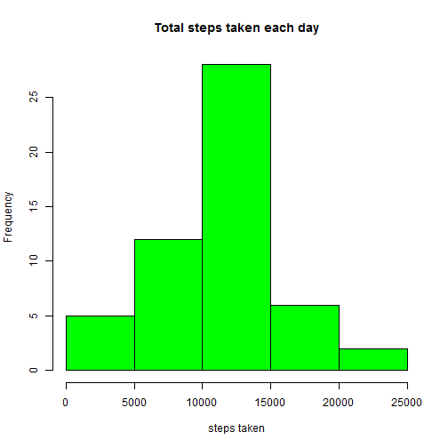
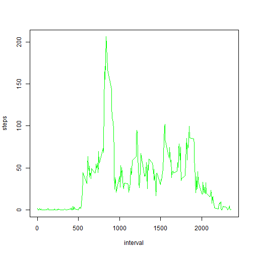
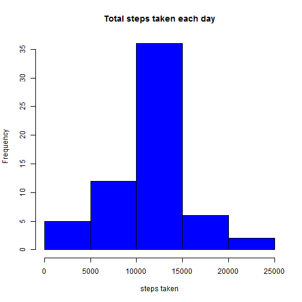

Title: Reproducible Research: Peer Assessment 1
================================================
### The purpose of this research is to analyse the steps taken by an individual, observed at 5-min intervals that are spread across 2 months.

## Loading and preprocessing the data

```r
AMdata <- read.csv("activity.csv")
head(AMdata)
```

```
##   steps       date interval
## 1    NA 2012-10-01        0
## 2    NA 2012-10-01        5
## 3    NA 2012-10-01       10
## 4    NA 2012-10-01       15
## 5    NA 2012-10-01       20
## 6    NA 2012-10-01       25
```


## What is total number of steps taken per day?

```r
Tdaysteps <- tapply(AMdata$steps, AMdata$date, sum)
hist(Tdaysteps, main = "Total steps taken each day", col="green", xlab="steps taken")
```

 


## What is the mean number of steps taken per day?

```r
Mean.Step <- tapply(AMdata$steps, AMdata$date, mean)
Mean.Step <- as.data.frame(Mean.Step)
Mean.Step
```

```
##             Mean.Step
## 2012-10-01         NA
## 2012-10-02  0.4375000
## 2012-10-03 39.4166667
## 2012-10-04 42.0694444
## 2012-10-05 46.1597222
## 2012-10-06 53.5416667
## 2012-10-07 38.2465278
## 2012-10-08         NA
## 2012-10-09 44.4826389
## 2012-10-10 34.3750000
## 2012-10-11 35.7777778
## 2012-10-12 60.3541667
## 2012-10-13 43.1458333
## 2012-10-14 52.4236111
## 2012-10-15 35.2048611
## 2012-10-16 52.3750000
## 2012-10-17 46.7083333
## 2012-10-18 34.9166667
## 2012-10-19 41.0729167
## 2012-10-20 36.0937500
## 2012-10-21 30.6284722
## 2012-10-22 46.7361111
## 2012-10-23 30.9652778
## 2012-10-24 29.0104167
## 2012-10-25  8.6527778
## 2012-10-26 23.5347222
## 2012-10-27 35.1354167
## 2012-10-28 39.7847222
## 2012-10-29 17.4236111
## 2012-10-30 34.0937500
## 2012-10-31 53.5208333
## 2012-11-01         NA
## 2012-11-02 36.8055556
## 2012-11-03 36.7048611
## 2012-11-04         NA
## 2012-11-05 36.2465278
## 2012-11-06 28.9375000
## 2012-11-07 44.7326389
## 2012-11-08 11.1770833
## 2012-11-09         NA
## 2012-11-10         NA
## 2012-11-11 43.7777778
## 2012-11-12 37.3784722
## 2012-11-13 25.4722222
## 2012-11-14         NA
## 2012-11-15  0.1423611
## 2012-11-16 18.8923611
## 2012-11-17 49.7881944
## 2012-11-18 52.4652778
## 2012-11-19 30.6979167
## 2012-11-20 15.5277778
## 2012-11-21 44.3993056
## 2012-11-22 70.9270833
## 2012-11-23 73.5902778
## 2012-11-24 50.2708333
## 2012-11-25 41.0902778
## 2012-11-26 38.7569444
## 2012-11-27 47.3819444
## 2012-11-28 35.3576389
## 2012-11-29 24.4687500
## 2012-11-30         NA
```


## What is the median number of steps taken per day?

```r
Median.Step <- tapply(AMdata$steps, AMdata$date, median)
Median.Step <- as.data.frame(Median.Step)
Median.Step
```

```
##            Median.Step
## 2012-10-01          NA
## 2012-10-02           0
## 2012-10-03           0
## 2012-10-04           0
## 2012-10-05           0
## 2012-10-06           0
## 2012-10-07           0
## 2012-10-08          NA
## 2012-10-09           0
## 2012-10-10           0
## 2012-10-11           0
## 2012-10-12           0
## 2012-10-13           0
## 2012-10-14           0
## 2012-10-15           0
## 2012-10-16           0
## 2012-10-17           0
## 2012-10-18           0
## 2012-10-19           0
## 2012-10-20           0
## 2012-10-21           0
## 2012-10-22           0
## 2012-10-23           0
## 2012-10-24           0
## 2012-10-25           0
## 2012-10-26           0
## 2012-10-27           0
## 2012-10-28           0
## 2012-10-29           0
## 2012-10-30           0
## 2012-10-31           0
## 2012-11-01          NA
## 2012-11-02           0
## 2012-11-03           0
## 2012-11-04          NA
## 2012-11-05           0
## 2012-11-06           0
## 2012-11-07           0
## 2012-11-08           0
## 2012-11-09          NA
## 2012-11-10          NA
## 2012-11-11           0
## 2012-11-12           0
## 2012-11-13           0
## 2012-11-14          NA
## 2012-11-15           0
## 2012-11-16           0
## 2012-11-17           0
## 2012-11-18           0
## 2012-11-19           0
## 2012-11-20           0
## 2012-11-21           0
## 2012-11-22           0
## 2012-11-23           0
## 2012-11-24           0
## 2012-11-25           0
## 2012-11-26           0
## 2012-11-27           0
## 2012-11-28           0
## 2012-11-29           0
## 2012-11-30          NA
```


## What is the average daily activity pattern?

```r
Mean.Step.5MinInt <- aggregate(steps ~ interval, data = AMdata, mean)
plot(Mean.Step.5MinInt, type = "l", col = "green")
```

 


## Which 5-minute interval contains the maximum number of steps?

```r
library(dplyr)
filter(Mean.Step.5MinInt, steps == max(steps))
```

```
##   interval    steps
## 1      835 206.1698
```


## What is the total number of missing values in the dataset?

```r
summary(AMdata)
```

```
##      steps                date          interval     
##  Min.   :  0.00   2012-10-01:  288   Min.   :   0.0  
##  1st Qu.:  0.00   2012-10-02:  288   1st Qu.: 588.8  
##  Median :  0.00   2012-10-03:  288   Median :1177.5  
##  Mean   : 37.38   2012-10-04:  288   Mean   :1177.5  
##  3rd Qu.: 12.00   2012-10-05:  288   3rd Qu.:1766.2  
##  Max.   :806.00   2012-10-06:  288   Max.   :2355.0  
##  NA's   :2304     (Other)   :15840
```
There are 2304 NA values and they are all in the "steps" variable.


## Create a new dataset that is equal to the original dataset but with the missing data filled in

```r
NAsteps <- is.na(AMdata$steps)
AMdata$steps[NAsteps] <- 37.38
summary(AMdata)
```

```
##      steps                date          interval     
##  Min.   :  0.00   2012-10-01:  288   Min.   :   0.0  
##  1st Qu.:  0.00   2012-10-02:  288   1st Qu.: 588.8  
##  Median :  0.00   2012-10-03:  288   Median :1177.5  
##  Mean   : 37.38   2012-10-04:  288   Mean   :1177.5  
##  3rd Qu.: 37.38   2012-10-05:  288   3rd Qu.:1766.2  
##  Max.   :806.00   2012-10-06:  288   Max.   :2355.0  
##                   (Other)   :15840
```


## What is total number of steps taken per day?

```r
Tdaysteps <- tapply(AMdata$steps, AMdata$date, sum)
hist(Tdaysteps, main = "Total steps taken each day", col="blue", xlab="steps taken")
```

 


## What is the mean number of steps taken per day?

```r
Mean.Step <- tapply(AMdata$steps, AMdata$date, mean)
Mean.Step <- as.data.frame(Mean.Step)
Mean.Step
```

```
##             Mean.Step
## 2012-10-01 37.3800000
## 2012-10-02  0.4375000
## 2012-10-03 39.4166667
## 2012-10-04 42.0694444
## 2012-10-05 46.1597222
## 2012-10-06 53.5416667
## 2012-10-07 38.2465278
## 2012-10-08 37.3800000
## 2012-10-09 44.4826389
## 2012-10-10 34.3750000
## 2012-10-11 35.7777778
## 2012-10-12 60.3541667
## 2012-10-13 43.1458333
## 2012-10-14 52.4236111
## 2012-10-15 35.2048611
## 2012-10-16 52.3750000
## 2012-10-17 46.7083333
## 2012-10-18 34.9166667
## 2012-10-19 41.0729167
## 2012-10-20 36.0937500
## 2012-10-21 30.6284722
## 2012-10-22 46.7361111
## 2012-10-23 30.9652778
## 2012-10-24 29.0104167
## 2012-10-25  8.6527778
## 2012-10-26 23.5347222
## 2012-10-27 35.1354167
## 2012-10-28 39.7847222
## 2012-10-29 17.4236111
## 2012-10-30 34.0937500
## 2012-10-31 53.5208333
## 2012-11-01 37.3800000
## 2012-11-02 36.8055556
## 2012-11-03 36.7048611
## 2012-11-04 37.3800000
## 2012-11-05 36.2465278
## 2012-11-06 28.9375000
## 2012-11-07 44.7326389
## 2012-11-08 11.1770833
## 2012-11-09 37.3800000
## 2012-11-10 37.3800000
## 2012-11-11 43.7777778
## 2012-11-12 37.3784722
## 2012-11-13 25.4722222
## 2012-11-14 37.3800000
## 2012-11-15  0.1423611
## 2012-11-16 18.8923611
## 2012-11-17 49.7881944
## 2012-11-18 52.4652778
## 2012-11-19 30.6979167
## 2012-11-20 15.5277778
## 2012-11-21 44.3993056
## 2012-11-22 70.9270833
## 2012-11-23 73.5902778
## 2012-11-24 50.2708333
## 2012-11-25 41.0902778
## 2012-11-26 38.7569444
## 2012-11-27 47.3819444
## 2012-11-28 35.3576389
## 2012-11-29 24.4687500
## 2012-11-30 37.3800000
```


## What is the median number of steps taken per day?

```r
Median.Step <- tapply(AMdata$steps, AMdata$date, median)
Median.Step <- as.data.frame(Median.Step)
Median.Step
```

```
##            Median.Step
## 2012-10-01       37.38
## 2012-10-02        0.00
## 2012-10-03        0.00
## 2012-10-04        0.00
## 2012-10-05        0.00
## 2012-10-06        0.00
## 2012-10-07        0.00
## 2012-10-08       37.38
## 2012-10-09        0.00
## 2012-10-10        0.00
## 2012-10-11        0.00
## 2012-10-12        0.00
## 2012-10-13        0.00
## 2012-10-14        0.00
## 2012-10-15        0.00
## 2012-10-16        0.00
## 2012-10-17        0.00
## 2012-10-18        0.00
## 2012-10-19        0.00
## 2012-10-20        0.00
## 2012-10-21        0.00
## 2012-10-22        0.00
## 2012-10-23        0.00
## 2012-10-24        0.00
## 2012-10-25        0.00
## 2012-10-26        0.00
## 2012-10-27        0.00
## 2012-10-28        0.00
## 2012-10-29        0.00
## 2012-10-30        0.00
## 2012-10-31        0.00
## 2012-11-01       37.38
## 2012-11-02        0.00
## 2012-11-03        0.00
## 2012-11-04       37.38
## 2012-11-05        0.00
## 2012-11-06        0.00
## 2012-11-07        0.00
## 2012-11-08        0.00
## 2012-11-09       37.38
## 2012-11-10       37.38
## 2012-11-11        0.00
## 2012-11-12        0.00
## 2012-11-13        0.00
## 2012-11-14       37.38
## 2012-11-15        0.00
## 2012-11-16        0.00
## 2012-11-17        0.00
## 2012-11-18        0.00
## 2012-11-19        0.00
## 2012-11-20        0.00
## 2012-11-21        0.00
## 2012-11-22        0.00
## 2012-11-23        0.00
## 2012-11-24        0.00
## 2012-11-25        0.00
## 2012-11-26        0.00
## 2012-11-27        0.00
## 2012-11-28        0.00
## 2012-11-29        0.00
## 2012-11-30       37.38
```


## What is the impact of imputing missing data on the estimates of the total daily number of steps?
### The mean and median values remain unchanged after the NA values are subset with 37.38, but the 3rd quartile value changes from 12.00 to 37.38.


## Are there differences in activity patterns between weekdays and weekends?


